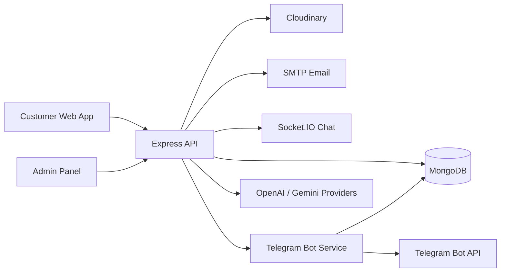

# Shop 3D Backend

Backend platform for a 3D furniture e-commerce product: catalog, admin panel API,
inventory, orders, loyalty, customer chat, AI assistant, Telegram account flows,
and operational tooling.

This repository is intended to be a production backend, not just a demo server.
It contains API routes, service-layer business logic, MongoDB models, Socket.IO
chat delivery, Telegram bot integration, Swagger documentation, and test coverage.

## Documentation

Start here:

- [Project Documentation](docs/PROJECT-DOCUMENTATION.md) - product scope, architecture, data flows, diagrams, and module map.
- [Operations Guide](docs/OPERATIONS.md) - local setup, environment variables, deploy checklist, security, and maintenance scripts.
- [Frontend API Reference](docs/frontend-api-reference.md) - frontend-facing endpoint notes.
- [Telegram Frontend Checklist](docs/telegram-frontend-checklist.md) - Telegram account and bot integration notes.
- [Product Questions](docs/product-questions.md) - public product question form and admin replies.
- [Password Reset](docs/password-reset.md) - forgot-password implementation notes.

## System Overview



## Key Capabilities

- Product catalog with categories, subcategories, attributes, colors, media, and 3D model metadata.
- Admin APIs for catalog, inventory, orders, users, product questions, planner textures, and chat.
- Inventory stock synchronization from warehouse rows to product availability fields.
- Customer account flows: auth, profile, addresses, likes, cart, loyalty, password reset, Telegram login.
- Real-time chat with delivery/read states, admin direct messages, and AI-assisted replies.
- Telegram bot microservice with secure account binding, notifications, login confirmation, and styled bot messages.
- Public form security with sanitization, safe raster upload checks, rate limits, and optional Cloudflare Turnstile.
- Swagger/OpenAPI JSON and UI.

## Quick Start

Install dependencies:

```bash
npm install
```

Create `.env` from `.env.example` and set at minimum:

```env
MONGO_URI=mongodb+srv://<user>:<pass>@cluster0.example.mongodb.net/shop-3d-backend?retryWrites=true&w=majority
JWT_SECRET=change-me
CLIENT_URL=http://localhost:5173
```

Run the backend:

```bash
npm run dev
```

Run the Telegram bot service when Telegram features are enabled:

```bash
npm run telegram:service
```

Run tests:

```bash
npm test
```

## API Documentation

Swagger UI:

- `GET /api-docs`
- `GET /api-docs.json`

For deployed environments, set:

```env
PUBLIC_API_URL=https://your-service.example.com
```

## Important Environment Groups

Core:

```env
NODE_ENV=development
PORT=5000
MONGO_URI=
JWT_SECRET=
CLIENT_URL=http://localhost:5173
```

Security:

```env
ALLOW_COOKIE_AUTH=false
SESSION_BINDING_MODE=report
CSP_ENABLED=true
TURNSTILE_SITE_KEY=
TURNSTILE_SECRET_KEY=
TURNSTILE_MIN_SCORE=0
REDIS_URL=
```

Email:

```env
SMTP_HOST=
SMTP_PORT=587
SMTP_USER=
SMTP_PASS=
SMTP_FROM=
SMTP_SECURE=false
PASSWORD_RESET_URL=http://localhost:5173/reset-password
```

Telegram:

```env
TELEGRAM_SERVICE_INTERNAL_URL=
TELEGRAM_INTERNAL_API_KEY=
TELEGRAM_BOT_TOKEN=
TELEGRAM_BOT_USERNAME=
WEBSITE_BASE_URL=
```

See [Operations Guide](docs/OPERATIONS.md) for the full setup and deployment checklist.

## Maintenance Scripts

```bash
npm run db:audit
npm run inventory:sync-stock
npm run seed:test
npm run seed:test:clear
```

## License

This project is proprietary and all rights are reserved. See [LICENSE](LICENSE).
