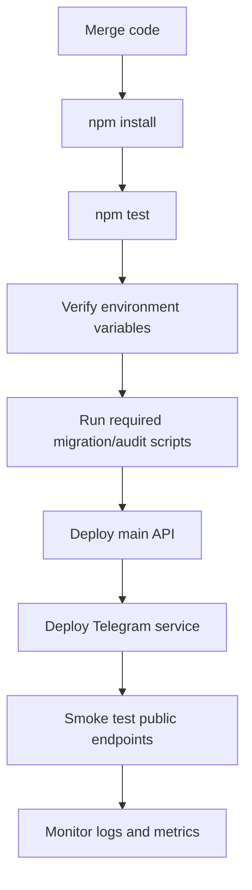
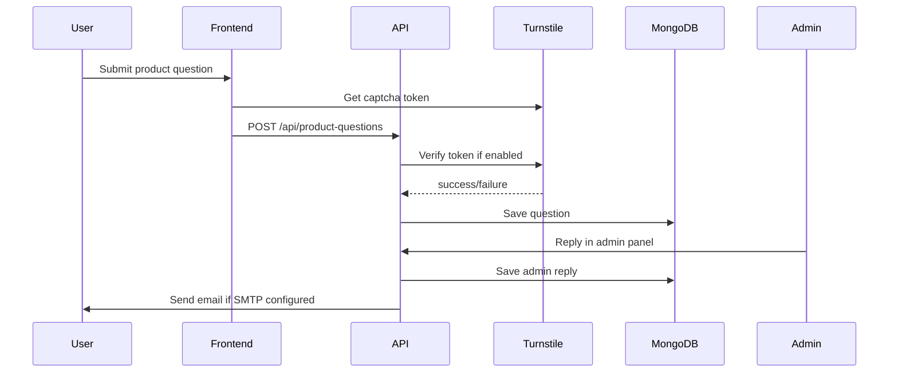
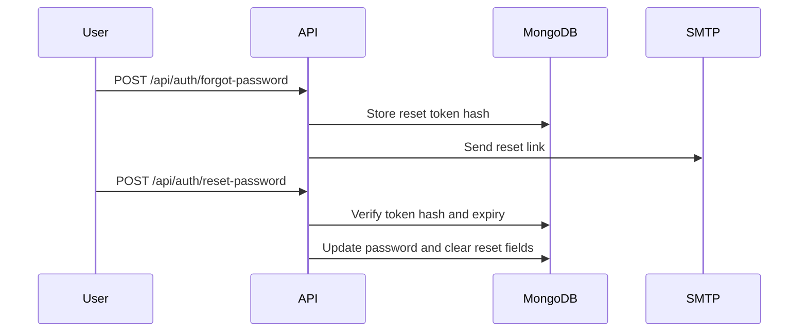

# Shop 3D Backend - Operations Guide

## 1. Purpose

This guide explains how to run, configure, validate, deploy, and maintain the
Shop 3D Backend in a professional environment.

## 2. Local Development

Install dependencies:

```bash
npm install
```

Create `.env`:

```bash
copy .env.example .env
```

Required minimum:

```env
MONGO_URI=mongodb+srv://<user>:<password>@<cluster>/<database>?retryWrites=true&w=majority
JWT_SECRET=replace-with-a-strong-secret
CLIENT_URL=http://localhost:5173
PORT=5000
```

Start the API:

```bash
npm run dev
```

Open Swagger:

```text
http://localhost:5000/api-docs
http://localhost:5000/api-docs.json
```

## 3. Telegram Bot Service

Run separately:

```bash
npm run telegram:service
```

Minimum Telegram-related variables:

```env
TELEGRAM_BOT_TOKEN=
TELEGRAM_BOT_USERNAME=
TELEGRAM_INTERNAL_API_KEY=
TELEGRAM_SERVICE_INTERNAL_URL=http://localhost:<telegram-service-port>/internal
WEBSITE_BASE_URL=http://localhost:5173
WEBSITE_INTERNAL_API_KEY=
```

Production setup:

- Use webhook mode when the Telegram service has a stable public HTTPS URL.
- Use polling only for local development or environments where webhook setup is unavailable.
- Keep `TELEGRAM_INTERNAL_API_KEY` and `WEBSITE_INTERNAL_API_KEY` strong and private.

## 4. Environment Checklist

Core:

```env
NODE_ENV=production
PORT=5000
PUBLIC_API_URL=https://api.example.com
CLIENT_URL=https://shop.example.com
MONGO_URI=
JWT_SECRET=
```

Security:

```env
ALLOW_COOKIE_AUTH=false
SESSION_BINDING_MODE=enforce
CSP_ENABLED=true
REDIS_URL=
```

Public form protection:

```env
TURNSTILE_SITE_KEY=
TURNSTILE_SECRET_KEY=
TURNSTILE_MIN_SCORE=0
```

Email:

```env
SMTP_HOST=
SMTP_PORT=587
SMTP_USER=
SMTP_PASS=
SMTP_FROM=
SMTP_SECURE=false
PASSWORD_RESET_URL=https://shop.example.com/reset-password
```

Media:

```env
CLOUDINARY_CLOUD_NAME=
CLOUDINARY_API_KEY=
CLOUDINARY_API_SECRET=
```

## 5. Deployment Flow



Recommended deployment checklist:

- Confirm `NODE_ENV=production`.
- Confirm production `MONGO_URI` points to the correct database.
- Confirm `JWT_SECRET` is strong and not reused across unrelated environments.
- Confirm CORS origin list includes the production frontend.
- Confirm Telegram internal URLs and API keys match both services.
- Confirm SMTP credentials work before enabling customer-facing email flows.
- Confirm `/api-docs.json` loads.
- Run tests before deployment.

## 6. Maintenance Scripts

Database integrity audit:

```bash
npm run db:audit
```

Inventory stock check or repair:

```bash
npm run inventory:sync-stock -- --check
npm run inventory:sync-stock
```

Seed demo data:

```bash
npm run seed:test
npm run seed:test:clear
```

Seed planner textures:

```bash
npm run planner-textures:seed
```

## 7. Operational Diagrams

### 7.1 Stock Sync

```mermaid
flowchart LR
  InventoryChange[Inventory change] --> Aggregate[Aggregate active location rows]
  Aggregate --> Compute[Compute available = max(0, onHand - reserved)]
  Compute --> ProductUpdate[Update Product stockQty / inStock]
  ProductUpdate --> Catalog[Catalog and admin responses]
```

### 7.2 Product Question With Turnstile



### 7.3 Password Reset



## 8. Security Runbook

If suspicious traffic appears:

1. Check rate-limit logs and request IDs.
2. Verify CORS origins and `CLIENT_URL`.
3. Ensure `ALLOW_COOKIE_AUTH=false` unless legacy cookie auth is intentionally needed.
4. Enable or verify Cloudflare Turnstile for public forms.
5. Rotate internal API keys if internal endpoints may have been exposed.
6. Review failed auth logs and admin write audit logs.

If upload abuse appears:

1. Confirm only safe raster image types are accepted.
2. Confirm static uploads are not executing browser-rendered SVG/HTML/JS.
3. Move runtime uploads to object storage if local disk is not controlled.
4. Audit existing upload files for unexpected extensions.

## 9. Backup And Recovery

Recommended:

- Enable managed MongoDB backups.
- Back up runtime uploads if local disk is used.
- Store production `.env` secrets in the hosting provider's secret manager.
- Keep deployment rollback instructions documented in the hosting platform.

Recovery priority:

1. Restore MongoDB data.
2. Restore environment variables.
3. Restore uploads or external media references.
4. Redeploy main backend.
5. Redeploy Telegram bot service.
6. Run `npm run db:audit`.

## 10. Release Checklist

Before release:

- `npm test` passes.
- `git diff --check` has no whitespace errors.
- Swagger JSON loads.
- Admin login works.
- Product catalog loads.
- Product create/update works for at least one test product.
- Inventory stock sync reports no unexpected mismatches.
- Telegram bot `/start`, `/menu`, and login confirmation work if Telegram is enabled.
- Password reset email is delivered in the target environment.

After release:

- Watch application logs for 30-60 minutes.
- Check error rate and slow endpoints.
- Check Telegram notification delivery logs.
- Check product question submissions.
- Check admin chat delivery/read states.
