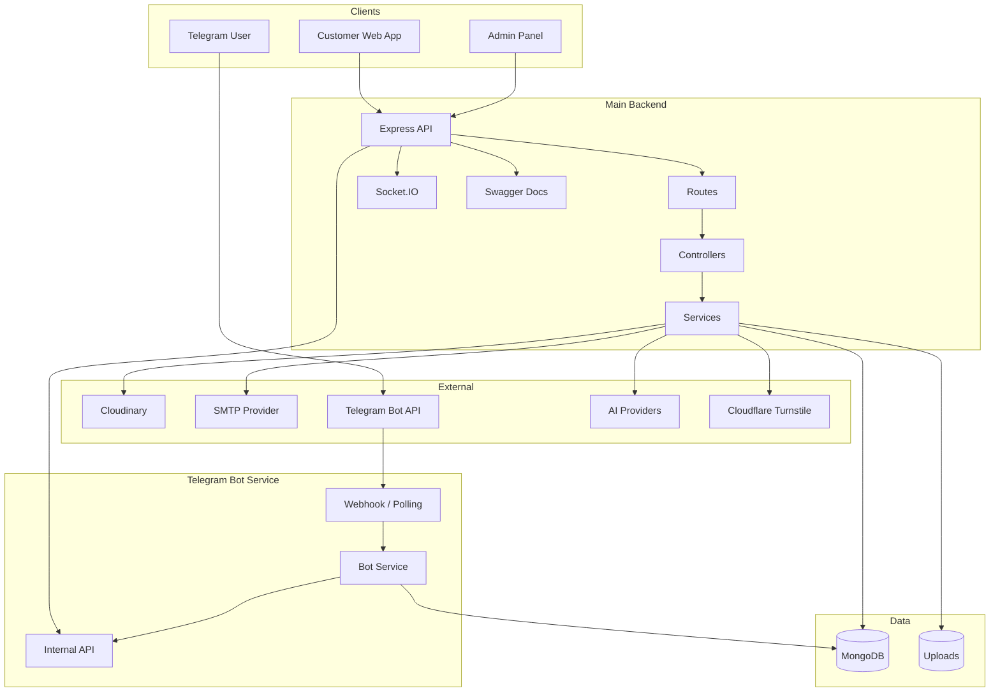
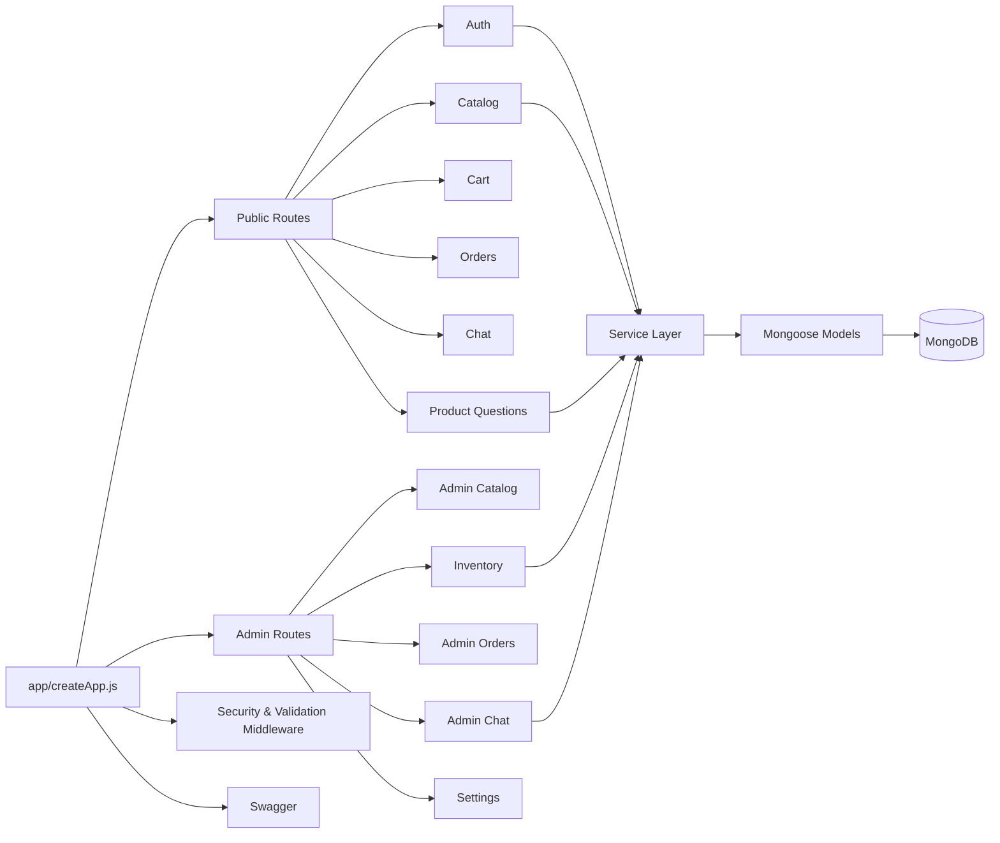
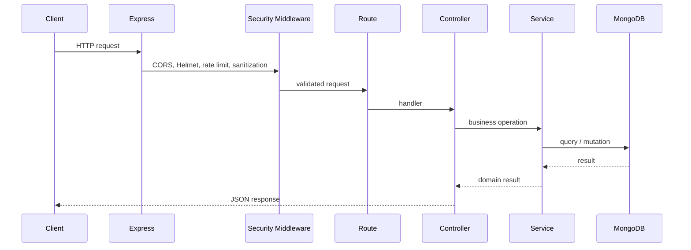
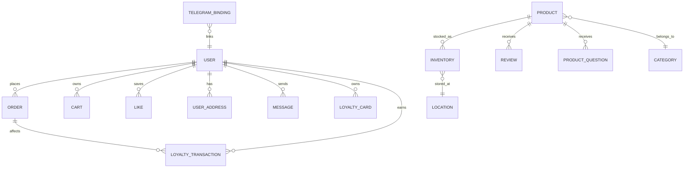
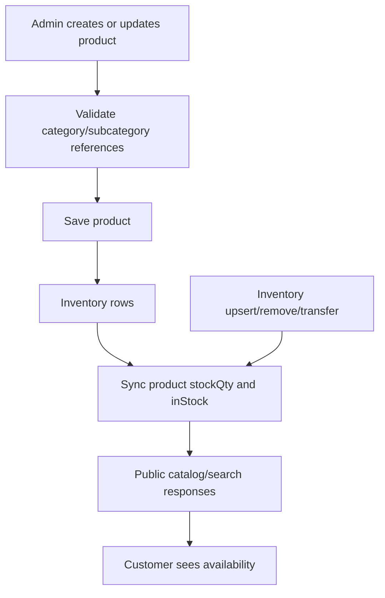
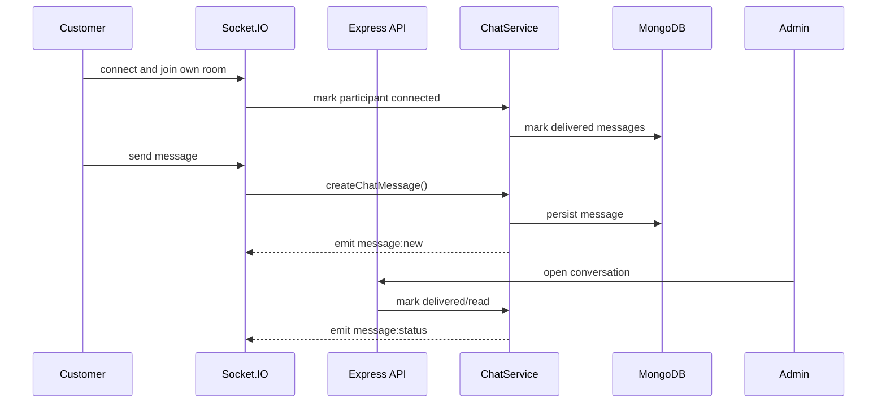
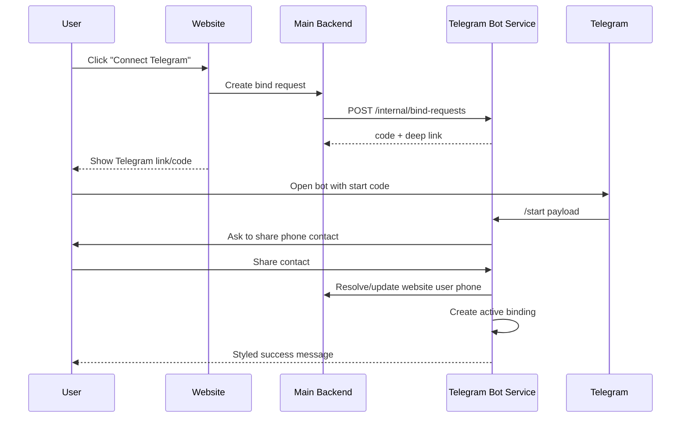
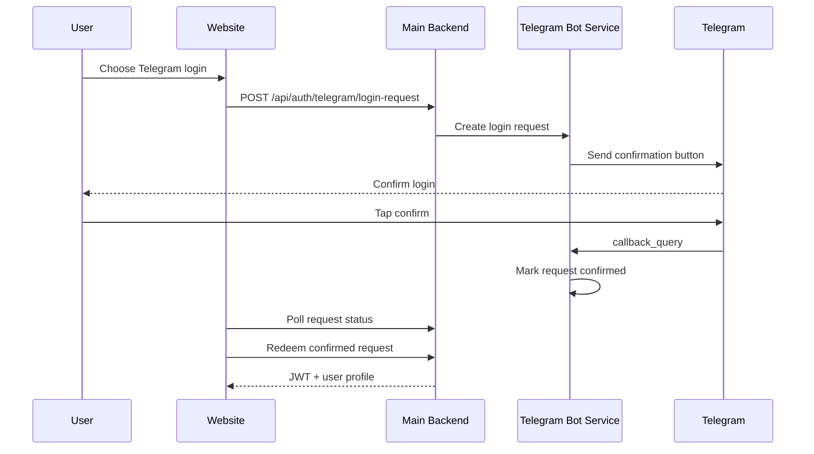
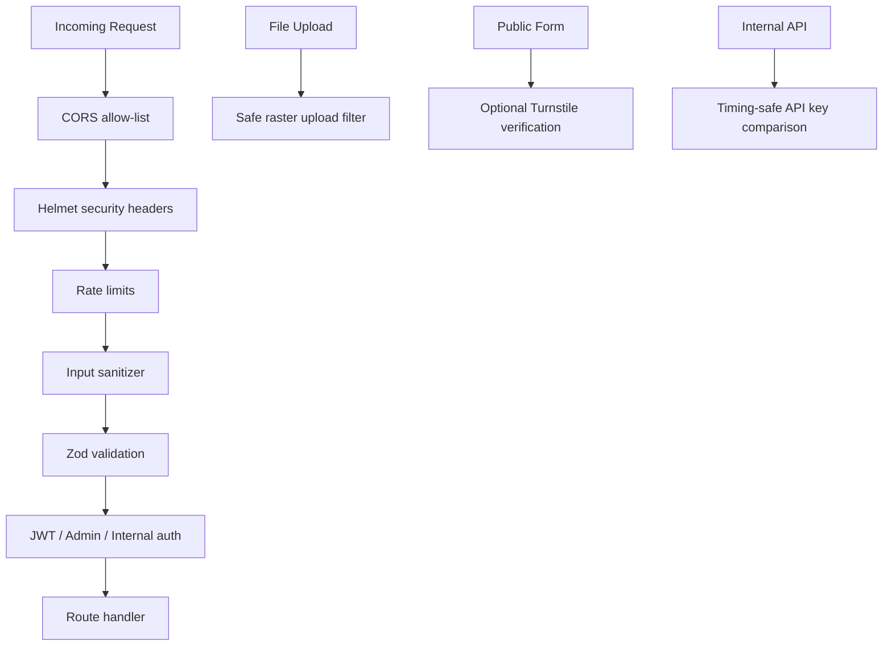
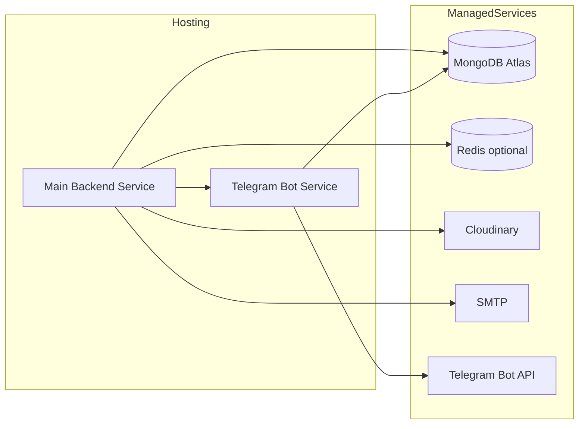

# Shop 3D Backend - Project Documentation

## 1. Executive Summary

Shop 3D Backend is the server-side platform for a furniture e-commerce product
with 3D-aware catalog data, admin operations, inventory control, customer
accounts, real-time support chat, AI-assisted responses, and Telegram account
integration.

The backend is organized as a Node.js/Express application with a separate
Telegram bot service. MongoDB is the primary database. The system also integrates
with SMTP for emails, Cloudinary for media, Socket.IO for live chat, and external
AI providers for assistant features.

## 2. Product Scope

Core business domains:

- Catalog: products, categories, subcategories, colors, materials, manufacturers, attributes, media, and 3D model metadata.
- Commerce: carts, likes, orders, inventory rows, stock synchronization, locations, loyalty cards, and transactions.
- Accounts: authentication, profile, addresses, password reset, session security, Telegram account binding.
- Admin: product management, inventory operations, order lifecycle, user management, product questions, planner textures, dashboard, and chat.
- Communication: customer chat, admin direct messages, AI assistant, product question emails, Telegram notifications.
- Operations: seed data, database integrity audit, stock sync scripts, Swagger API docs, test suite.

## 3. High-Level Architecture



## 4. Backend Module Map



## 5. Request Lifecycle



## 6. Data Model Overview



Primary model groups:

- `models/Product.js`, `models/Category.js`, `models/SubCategory.js`: catalog structure.
- `models/Inventory.js`, `models/InventoryMovement.js`, `models/Location.js`: stock and warehouse state.
- `models/Order.js`, `models/Cart.js`, `models/Like.js`: commerce state.
- `models/userModel.js`, `models/UserAddress.js`: customer and admin accounts.
- `models/Message.js`: chat history and delivery/read state.
- `models/LoyaltyCard.js`, `models/LoyaltyTransaction.js`: loyalty accounting.
- `telegram-bot-service/models/*`: Telegram bindings, auth requests, notification logs, audit logs.

## 7. Catalog And Inventory Flow



Key implementation areas:

- `services/catalogIntegrityService.js`: prevents invalid product/category references.
- `services/productStockSyncService.js`: computes stock from inventory rows.
- `scripts/auditDatabaseIntegrity.js`: reports inconsistent database state.
- `scripts/syncProductStockFromInventory.js`: repairs product stock fields from inventory.

## 8. Chat And Support Flow



Supported chat capabilities:

- Human support messages.
- Guest and authenticated customer conversations.
- Admin direct-message endpoint.
- Delivery/read state (`sent`, `delivered`, `read`).
- Presence metadata for admin conversation summaries.
- AI admin assistant integration through `services/aiAdminService.js`.

## 9. Telegram Account And Bot Flows

### 9.1 Account Binding



### 9.2 Telegram Login



Telegram service files:

- `telegram-bot-service/services/botService.js`: bot commands, menu, profile, orders, notifications.
- `telegram-bot-service/services/authRequestService.js`: bind/login/recovery request lifecycle.
- `telegram-bot-service/services/notificationService.js`: user and campaign notifications.
- `services/telegramServiceClient.js`: main backend client for internal Telegram service calls.

## 10. Security Architecture



Security controls currently present:

- Centralized request sanitization removes dangerous Mongo operator and dotted keys.
- Upload filters reject SVG and non-raster image uploads for image fields.
- Static uploads add `nosniff` and force attachment for risky extensions.
- Internal API keys use timing-safe comparison.
- Public product questions can require Cloudflare Turnstile.
- Production error handler hides internal error details for 5xx responses.
- Session binding can run in report or enforce mode.

## 11. Deployment Topology



Recommended deployment split:

- Main backend service: public HTTP API, Swagger, Socket.IO, admin and customer routes.
- Telegram bot service: public webhook or polling worker plus internal endpoints protected by API key.
- MongoDB Atlas: shared database for backend and Telegram service.
- Optional Redis: distributed rate limits in multi-instance deployments.

## 12. Directory Structure

```text
app/                    Express app factory, core middleware, error handling
admin/                  Admin API router and admin-specific routes
bootstrap/              Server startup
config/                 Environment, CORS, Cloudinary
controllers/            HTTP controllers
docs/                   Project and API documentation
middleware/             Legacy/global middleware
models/                 Mongoose models
routes/                 Public/customer API routes
scripts/                Maintenance, seed, migration, audit scripts
services/               Business logic and integrations
sockets/                Socket.IO server
telegram-bot-service/   Telegram microservice
tests/                  Node test runner tests
```

## 13. Quality Gates

Current validation command:

```bash
npm test
```

Recommended before deployment:

```bash
npm test
npm run db:audit
npm run inventory:sync-stock -- --check
```

## 14. Known Operational Notes

- `MONGO_URI` is required. The backend should not silently fall back to a local database.
- If `TURNSTILE_SECRET_KEY` is empty, product question Turnstile verification is disabled.
- If SMTP is unavailable, admin product question replies are still saved, but email delivery returns `email.sent: false`.
- Telegram login and recovery require an active Telegram binding.
- Uploaded runtime files are ignored by Git and should be backed up or stored externally in production.
